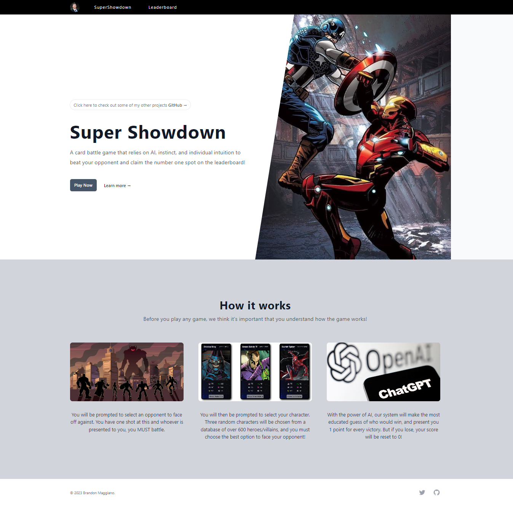
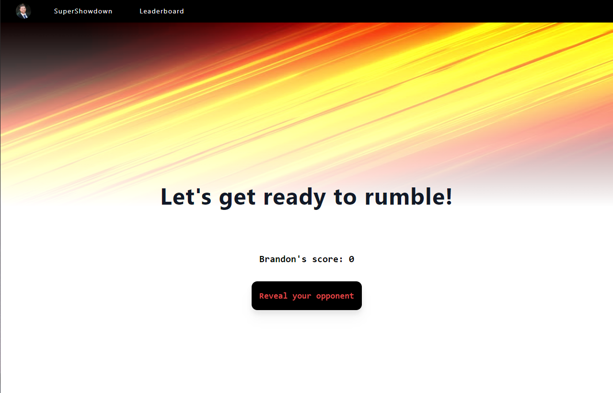
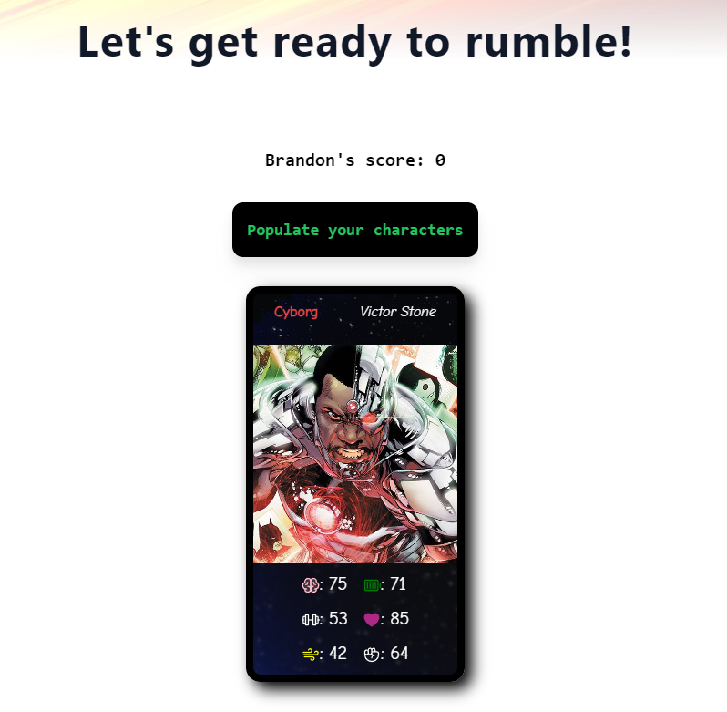
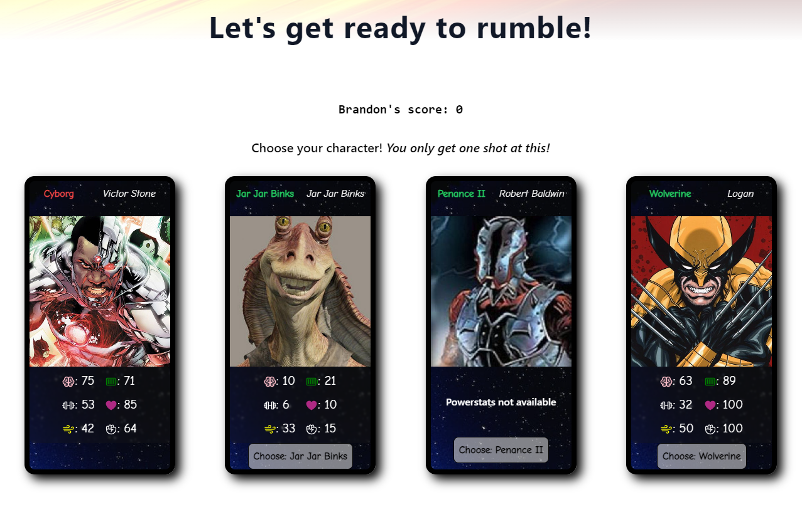
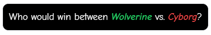
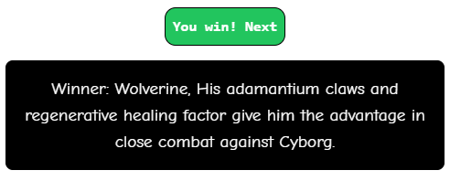
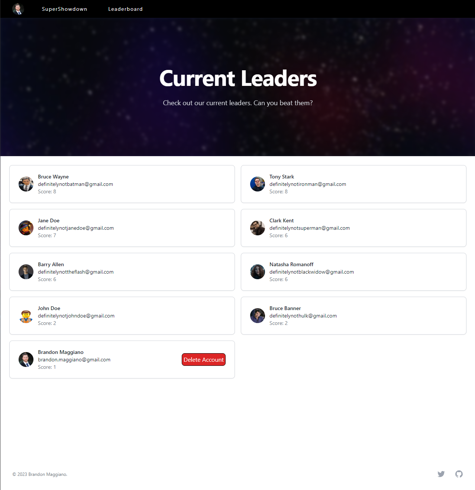

# Super Showdown

## Link to deployed app (coming soon)

## Table of Contents

- [Description](#description)
- [Features](#features)
- [Education](#education)
- [Tech-Used](#tech-used)

## Description

Super Showdown is a fascinating full stack application that allows users to put themselves in hypothetical scenarios about who would come out victorious between some of our favorite comic/tv/cartoon characters. Once the user logs in they will be presented a landing page in which they can look at the leaderboard, learn more, or play now. If the user selects the play now button, a brief copy of their name, email, Google profile image, and score will be copied into a Prisma db so they can keep track of how they fare against other users.

Once they're about to play the game, a button will be presented to them prompting them to reveal their opponent. 

Once they do so, an opponent card will present itself and a new button will appear prompting the user to reveal their choices.

Upon clicking the button to populate your characters, the user will then be given 3 different choices of characters that they're going to select to fight the opponent before them.

Once the user has selected their character, a new button will appear setting the groundwork for this new battle.

Finally with the power of AI and the Chat-GPT-3.5 model, we will send all the data to determine the outcome of the battle and we will be presented with a scenario in which the user wins (+1 Score) or the opponent wins (resets user's score to 0)!

It's up to the user to see how far they can keep going before their scores reset, and also be strategic about when to give up. Because no one wants their score to be reset!

## Features

Besides the awesome nature of OpenAI, Prisma db, Clerk for Google user authentication, one of the main features of this website is the ability to see how you compare with all other users. 

This feature allows you to literally beat your friends by one point and retire until they choose to re open the app.

## Education

Developing and designing this app allowed me to learn the ins and outs of 2 different technologies that I haven't used before and the struggle of implementing them in a clean manner. I found that Prismas schema.prisma file as well as being able to migrate that into a MySQL database was a rather quick approach to setting up a basic users table. I also found that Clerk makes it extremely easy to wrap your app in a Google based authentication system, and not only that, but they made it possible to migrate as much or as little data as you want into your Prisma db so we don't have to use forms anymore for sign-up. We can just skip right to log-in assuming the user has a Google account. Not only all this, but further understanding the src layout of NextJs was also cemented in my head. Having a good structure of where files need to go (client, server, api routes, css global, page.module.css) can be a little overwhelming at first, but doing a full stack project like this helps a lot!

## Tech-Used:

OpenAI's Chat-GPT-3.5 Turbo model for sending prompts about the battle.
Prisma DB to store the bare bones data about the user.
Clerk for user authentication.
The SuperheroAPI for making API calls to over 700 characters worth of data.
NextJs for the app itself.
Tailwind CSS and Tailwind UI for layout of the app and some landing pages.
Typescript.
Vanilla CSS for card styling.
